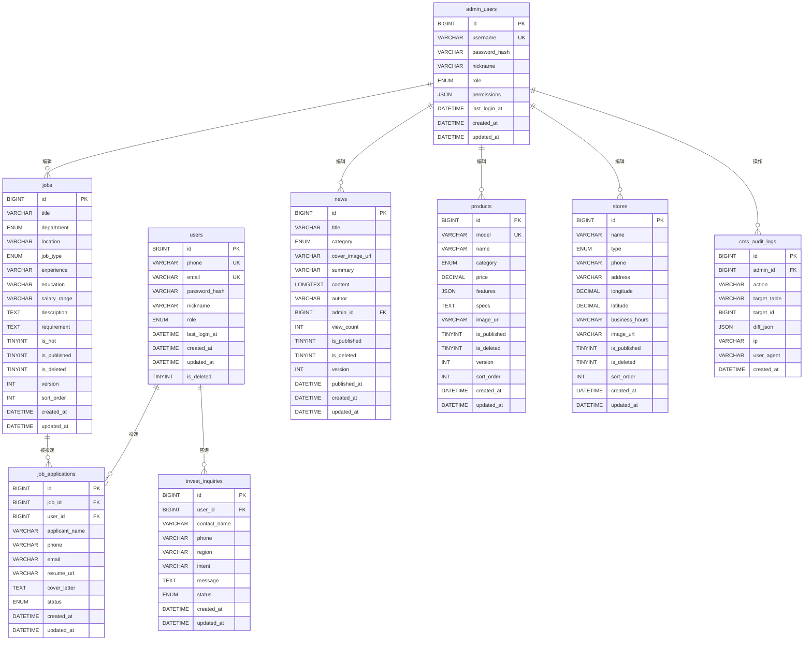

# 小维健康科技官网 3.0 — 数据库 Schema 设计文档

> **版本**: v1.0
> **更新日期**: 2026-07-21
> **关联文档**: `PROTOTYPE_PAGES.md` / `DEV_LOG.md` / `project_memory.md` 后端与部署规划章节
> **目标数据库**: MySQL 8.0 (阿里云 RDS 高可用版)
> **字符集**: `utf8mb4` + `utf8mb4_unicode_ci` (支持 emoji 和多语言)
> **存储引擎**: InnoDB (支持事务、外键、行级锁)

---

## 一、概述

本文档定义小维健康科技官网 3.0 的完整数据库结构,覆盖:
- **C 端用户系统**: 注册登录 / 简历投递 / 招商咨询
- **内容管理系统 (CMS)**: 新闻文章 / 招聘职位 / 产品 / 门店的可编辑化
- **后台审计**: 操作日志 / 权限隔离

设计原则:
1. **C 端用户与 B 端管理员分离** — `users` 表只存注册用户(投简历、咨询),`admin_users` 表存 CMS 操作员,避免权限混淆
2. **软删除优先** — 业务数据(文章/职位/产品)用 `is_deleted` 标记,不物理删除,便于回滚和审计
3. **乐观锁** — 内容编辑用 `version` 字段防止并发覆盖
4. **冗余字段最小化** — 优先 3NF,仅在高频查询场景做反范式冗余(如 `news.view_count`)
5. **时间戳规范** — 所有表必含 `created_at` / `updated_at`,重要业务表加 `published_at` / `deleted_at`

---

## 二、命名规范

| 类别 | 规范 | 示例 |
|---|---|---|
| 表名 | 小写蛇形,复数,业务前缀 | `users` / `news` / `job_applications` |
| 字段名 | 小写蛇形 | `phone` / `created_at` / `is_published` |
| 主键 | 统一 `id`, BIGINT UNSIGNED AUTO_INCREMENT | `id BIGINT UNSIGNED PRIMARY KEY AUTO_INCREMENT` |
| 外键 | `{引用表单数}_id` | `job_id` / `user_id` / `admin_id` |
| 布尔字段 | `is_` / `has_` 前缀, TINYINT(1) | `is_published` / `has_read` |
| 时间字段 | `_at` 后缀, DATETIME | `created_at` / `deleted_at` |
| 状态字段 | `status`, VARCHAR(32), 枚举值 | `status ENUM('pending','approved','rejected')` |
| 索引名 | `idx_{字段}` / `idx_{字段1}_{字段2}` (联合) | `idx_phone` / `idx_category_published` |
| 唯一索引 | `uk_{字段}` | `uk_phone` / `uk_email` |
| 外键约束 | `fk_{当前表}_{引用表}` | `fk_job_applications_jobs` |

---

## 三、安全规范

### 3.1 密码存储
- **算法**: bcrypt (cost factor = 12)
- **格式**: `$2b$12$...` (60 字符)
- **禁止**: 明文 / MD5 / SHA1 / SHA256 无盐
- **实现**: NestJS 用 `bcrypt` 库,Node.js 原生 `crypto.scrypt` 也可

### 3.2 敏感字段
- `users.password_hash` — 仅服务端可读,API 响应禁止返回
- `users.phone` — API 响应脱敏 (`138****1234`)
- `users.email` — API 响应脱敏 (`a***@example.com`)
- `admin_users.password_hash` — 同上
- `cms_audit_logs.diff_json` — 记录变更前后的字段值,敏感字段(密码)不记录

### 3.3 鉴权
- **JWT**: HS256 算法, secret 至少 32 字节随机字符串
- **Access Token**: 有效期 2 小时, 存 HttpOnly Cookie (推荐) 或 localStorage
- **Refresh Token**: 有效期 30 天, 存 HttpOnly Cookie (SameSite=Strict), 一次性使用
- **Token 撤销**: Redis 维护黑名单 (用户主动登出 / 修改密码时)

### 3.4 SQL 注入防护
- 全部使用参数化查询 (NestJS + TypeORM / Prisma 默认参数化)
- 禁止字符串拼接 SQL
- 用户输入做白名单校验 (手机号 `^1[3-9]\d{9}$` / 邮箱标准 RFC 5322)

### 3.5 接口限流
- 登录接口: 同 IP 5 次/分钟, 同账号 3 次/分钟
- 注册接口: 同 IP 3 次/分钟, 发送验证码 1 次/分钟
- 短信验证码: 同手机号 1 条/分钟, 5 条/天, 同 IP 10 条/天
- 实现: Redis + 令牌桶 / 滑动窗口

### 3.6 图形验证码
- 阿里云人机验证 (滑动拼图 / 文字点选)
- 触发场景: 登录失败 3 次 / 注册 / 找回密码 / 发送短信

---

## 四、ER 关系图 (Mermaid)

---

## 五、表清单总览

| # | 表名 | 业务模块 | 记录量级 (1 年预估) | 说明 |
|---|---|---|---|---|
| 1 | `users` | C 端用户 | 1-10 万 | 注册用户,可投递简历/咨询 |
| 2 | `admin_users` | B 端 CMS | 5-20 | 后台操作员,角色权限隔离 |
| 3 | `news` | 资讯中心 | 100-500 | 3 分类: 公司新闻/产品资讯/行业资讯 |
| 4 | `jobs` | 人才招聘 | 20-50 | 4 类: 技术研发/生产制造/市场营销/人事行政财务 |
| 5 | `job_applications` | 简历投递 | 1000-5000 | 用户投递记录 |
| 6 | `products` | 产品展示 | 12-30 | 12 款助听器 + 后续穿戴产品 |
| 7 | `stores` | 门店展示 | 10-200 | 直营+联营门店 |
| 8 | `invest_inquiries` | 招商咨询 | 100-1000 | 招商加盟咨询表单 |
| 9 | `cms_audit_logs` | 后台审计 | 1-10 万 | 谁在何时改了什么 |

---

## 六、表详细定义

### 6.1 `users` — C 端注册用户表

**用途**: 注册登录主体,可投递简历、收藏职位、提交招商咨询

| 字段 | 类型 | 约束 | 默认值 | 说明 |
|---|---|---|---|---|
| `id` | BIGINT UNSIGNED | PK, AI | — | 主键 |
| `phone` | VARCHAR(20) | UK, NOT NULL | — | 手机号 (中国大陆 11 位),登录主键之一 |
| `email` | VARCHAR(128) | UK, NULL | NULL | 邮箱 (备选登录方式) |
| `password_hash` | VARCHAR(60) | NOT NULL | — | bcrypt 加密后的密码 |
| `nickname` | VARCHAR(64) | NOT NULL | — | 昵称,默认取手机号后 4 位 |
| `avatar_url` | VARCHAR(255) | NULL | NULL | 头像 URL (OSS 路径) |
| `role` | ENUM('visitor','vip') | NOT NULL | 'visitor' | C 端用户角色,vip 为付费会员 |
| `status` | ENUM('active','disabled') | NOT NULL | 'active' | 账号状态,disabled 可由管理员封禁 |
| `last_login_at` | DATETIME | NULL | NULL | 最近登录时间 |
| `last_login_ip` | VARCHAR(45) | NULL | NULL | 最近登录 IP (支持 IPv6) |
| `created_at` | DATETIME | NOT NULL | CURRENT_TIMESTAMP | 注册时间 |
| `updated_at` | DATETIME | NOT NULL | CURRENT_TIMESTAMP ON UPDATE CURRENT_TIMESTAMP | 更新时间 |
| `is_deleted` | TINYINT(1) | NOT NULL | 0 | 软删除 |

**索引**:
- `uk_phone` (phone) — 唯一索引,登录查询
- `uk_email` (email) — 唯一索引,邮箱登录
- `idx_created_at` (created_at) — 按注册时间排序
- `idx_status_deleted` (status, is_deleted) — 后台筛选活跃用户

---

### 6.2 `admin_users` — 后台管理员表

**用途**: CMS 后台操作员,与 C 端用户完全隔离,权限更细

| 字段 | 类型 | 约束 | 默认值 | 说明 |
|---|---|---|---|---|
| `id` | BIGINT UNSIGNED | PK, AI | — | 主键 |
| `username` | VARCHAR(32) | UK, NOT NULL | — | 登录用户名 (英文+数字) |
| `password_hash` | VARCHAR(60) | NOT NULL | — | bcrypt 加密 |
| `nickname` | VARCHAR(64) | NOT NULL | — | 显示名 (中文) |
| `email` | VARCHAR(128) | NULL | NULL | 邮箱 (找回密码) |
| `phone` | VARCHAR(20) | NULL | NULL | 手机号 (二次验证) |
| `role` | ENUM('super_admin','editor','hr','readonly') | NOT NULL | 'readonly' | 角色 |
| `permissions` | JSON | NULL | NULL | 细粒度权限 (覆盖角色默认权限) |
| `status` | ENUM('active','disabled') | NOT NULL | 'active' | 状态 |
| `last_login_at` | DATETIME | NULL | NULL | 最近登录 |
| `last_login_ip` | VARCHAR(45) | NULL | NULL | 最近 IP |
| `created_at` | DATETIME | NOT NULL | CURRENT_TIMESTAMP | 创建时间 |
| `updated_at` | DATETIME | NOT NULL | CURRENT_TIMESTAMP ON UPDATE CURRENT_TIMESTAMP | 更新时间 |

**角色权限矩阵**:

| 角色 | 文章 | 职位 | 产品 | 门店 | 用户 | 投递 | 招商咨询 | 管理员 | 审计日志 |
|---|---|---|---|---|---|---|---|---|---|
| `super_admin` | CRUD | CRUD | CRUD | CRUD | CRUD | R | CRUD | CRUD | R |
| `editor` | CRUD | — | R | — | — | — | — | — | — |
| `hr` | — | CRUD | — | — | R | R/U | — | — | — |
| `readonly` | R | R | R | R | R | R | R | — | — |

> C=Create, R=Read, U=Update, D=Delete, — =无权限

**索引**:
- `uk_username` (username) — 唯一索引,登录查询
- `idx_role_status` (role, status) — 后台筛选

---

### 6.3 `news` — 资讯文章表

**用途**: 资讯中心 3 个分类的文章 (公司新闻 / 产品资讯 / 行业资讯)

| 字段 | 类型 | 约束 | 默认值 | 说明 |
|---|---|---|---|---|
| `id` | BIGINT UNSIGNED | PK, AI | — | 主键 |
| `title` | VARCHAR(255) | NOT NULL | — | 标题 |
| `category` | ENUM('company','product','industry') | NOT NULL | — | 分类: 公司新闻/产品资讯/行业资讯 |
| `cover_image_url` | VARCHAR(255) | NULL | NULL | 封面图 URL (OSS) |
| `summary` | VARCHAR(500) | NULL | NULL | 摘要 (列表展示) |
| `content` | LONGTEXT | NOT NULL | — | 正文 HTML (富文本) |
| `author` | VARCHAR(64) | NULL | '大声助听器' | 作者/来源 |
| `admin_id` | BIGINT UNSIGNED | FK, NULL | NULL | 最后编辑的管理员 |
| `view_count` | INT UNSIGNED | NOT NULL | 0 | 浏览量 |
| `is_published` | TINYINT(1) | NOT NULL | 0 | 是否发布 (0=草稿, 1=已发布) |
| `is_deleted` | TINYINT(1) | NOT NULL | 0 | 软删除 |
| `version` | INT UNSIGNED | NOT NULL | 1 | 乐观锁版本号 |
| `sort_order` | INT | NOT NULL | 0 | 手动排序 (置顶) |
| `published_at` | DATETIME | NULL | NULL | 发布时间 (定时发布) |
| `created_at` | DATETIME | NOT NULL | CURRENT_TIMESTAMP | 创建时间 |
| `updated_at` | DATETIME | NOT NULL | CURRENT_TIMESTAMP ON UPDATE CURRENT_TIMESTAMP | 更新时间 |

**索引**:
- `idx_category_published_deleted` (category, is_published, is_deleted) — 前台列表查询主索引
- `idx_published_at` (published_at DESC) — 按发布时间排序
- `idx_admin_id` (admin_id) — 查某管理员编辑的文章
- `idx_sort_order` (sort_order) — 手动置顶
- `FULLTEXT idx_title_content` (title, content) WITH PARSER ngram — 中文全文搜索 (MySQL 8.0 ngram 分词)

---

### 6.4 `jobs` — 招聘职位表

**用途**: 人才招聘页 4 个分类的职位 (技术研发/生产制造/市场营销/人事行政财务)

| 字段 | 类型 | 约束 | 默认值 | 说明 |
|---|---|---|---|---|
| `id` | BIGINT UNSIGNED | PK, AI | — | 主键 |
| `title` | VARCHAR(128) | NOT NULL | — | 职位名 |
| `department` | ENUM('tech','manufacturing','marketing','hr_admin') | NOT NULL | — | 部门分类 |
| `location` | VARCHAR(64) | NOT NULL | — | 工作地点 (如 "深圳龙华") |
| `job_type` | ENUM('full_time','part_time','intern') | NOT NULL | 'full_time' | 全职/兼职/实习 |
| `experience` | VARCHAR(32) | NULL | NULL | 经验要求 (如 "3-5年") |
| `education` | VARCHAR(32) | NULL | NULL | 学历 (如 "本科及以上") |
| `headcount` | VARCHAR(32) | NULL | NULL | 招聘人数 (如 "2" / "若干") |
| `salary_range` | VARCHAR(64) | NULL | NULL | 薪资范围 (如 "15-30K") |
| `description` | TEXT | NULL | NULL | 岗位职责 (富文本) |
| `requirement` | TEXT | NULL | NULL | 任职要求 (富文本) |
| `is_hot` | TINYINT(1) | NOT NULL | 0 | 是否热门 (首页/列表加标签) |
| `is_published` | TINYINT(1) | NOT NULL | 0 | 是否发布 |
| `is_deleted` | TINYINT(1) | NOT NULL | 0 | 软删除 |
| `version` | INT UNSIGNED | NOT NULL | 1 | 乐观锁 |
| `sort_order` | INT | NOT NULL | 0 | 排序 |
| `created_at` | DATETIME | NOT NULL | CURRENT_TIMESTAMP | 创建时间 |
| `updated_at` | DATETIME | NOT NULL | CURRENT_TIMESTAMP ON UPDATE CURRENT_TIMESTAMP | 更新时间 |

**索引**:
- `idx_department_published_deleted` (department, is_published, is_deleted) — 前台按分类查询
- `idx_is_hot` (is_hot) — 热门职位
- `idx_sort_order` (sort_order)

---

### 6.5 `job_applications` — 简历投递记录表

**用途**: 用户投递简历的记录,关联用户和职位

| 字段 | 类型 | 约束 | 默认值 | 说明 |
|---|---|---|---|---|
| `id` | BIGINT UNSIGNED | PK, AI | — | 主键 |
| `job_id` | BIGINT UNSIGNED | FK NOT NULL | — | 关联 `jobs.id` |
| `user_id` | BIGINT UNSIGNED | FK NULL | NULL | 关联 `users.id` (未登录用户允许 NULL) |
| `applicant_name` | VARCHAR(64) | NOT NULL | — | 应聘者姓名 |
| `phone` | VARCHAR(20) | NOT NULL | — | 联系电话 |
| `email` | VARCHAR(128) | NULL | NULL | 邮箱 |
| `resume_url` | VARCHAR(255) | NULL | NULL | 简历文件 URL (OSS, PDF/DOC) |
| `cover_letter` | TEXT | NULL | NULL | 求职信 |
| `status` | ENUM('pending','reviewing','interview','offer','rejected','hired') | NOT NULL | 'pending' | 投递状态 |
| `admin_id` | BIGINT UNSIGNED | FK NULL | NULL | 处理人 (HR) |
| `remark` | TEXT | NULL | NULL | HR 备注 |
| `created_at` | DATETIME | NOT NULL | CURRENT_TIMESTAMP | 投递时间 |
| `updated_at` | DATETIME | NOT NULL | CURRENT_TIMESTAMP ON UPDATE CURRENT_TIMESTAMP | 更新时间 |

**索引**:
- `idx_job_id` (job_id) — 按职位查投递
- `idx_user_id` (user_id) — 按用户查投递历史
- `idx_status` (status) — HR 后台按状态筛选
- `idx_created_at` (created_at) — 按时间排序
- `uk_user_job` (user_id, job_id) — 同一用户 7 天内不可重复投递同职位 (业务层校验,加唯一索引防重复)

**外键约束**:
- `fk_job_applications_jobs` FOREIGN KEY (job_id) REFERENCES jobs(id) ON DELETE RESTRICT
- `fk_job_applications_users` FOREIGN KEY (user_id) REFERENCES users(id) ON DELETE SET NULL
- `fk_job_applications_admins` FOREIGN KEY (admin_id) REFERENCES admin_users(id) ON DELETE SET NULL

---

### 6.6 `products` — 产品展示表

**用途**: 12 款助听器 + 后续穿戴产品

| 字段 | 类型 | 约束 | 默认值 | 说明 |
|---|---|---|---|---|
| `id` | BIGINT UNSIGNED | PK, AI | — | 主键 |
| `model` | VARCHAR(32) | UK, NOT NULL | — | 型号 (如 DAB005) |
| `name` | VARCHAR(128) | NOT NULL | — | 产品名 (如 "臻听版") |
| `category` | ENUM('hearing_aid','smartwatch','earphone') | NOT NULL | — | 大类: 助听器/智能手表/耳机 |
| `form_factor` | ENUM('bte','ite','neck','bone','box','watch_adult','watch_kid','earphone') | NULL | NULL | 形态: 耳背/耳内/颈挂/骨导/体佩/成人手表/儿童手表/耳机 |
| `price_min` | DECIMAL(10,2) | NULL | NULL | 最低价 |
| `price_max` | DECIMAL(10,2) | NULL | NULL | 最高价 |
| `price_note` | VARCHAR(64) | NULL | NULL | 价格说明 (如 "Pro 12999 / Max 15999") |
| `features` | JSON | NULL | NULL | 核心特性数组 (如 `[{"label":"算法2.0","desc":"中文言语增强补偿"}]`) |
| `specs` | JSON | NULL | NULL | 详细规格参数 (键值对) |
| `description` | TEXT | NULL | NULL | 产品介绍 |
| `image_url` | VARCHAR(255) | NULL | NULL | 主图 URL |
| `gallery_urls` | JSON | NULL | NULL | 多图轮播 URL 数组 |
| `is_published` | TINYINT(1) | NOT NULL | 0 | 是否发布 |
| `is_deleted` | TINYINT(1) | NOT NULL | 0 | 软删除 |
| `version` | INT UNSIGNED | NOT NULL | 1 | 乐观锁 |
| `sort_order` | INT | NOT NULL | 0 | 排序 |
| `created_at` | DATETIME | NOT NULL | CURRENT_TIMESTAMP | 创建时间 |
| `updated_at` | DATETIME | NOT NULL | CURRENT_TIMESTAMP ON UPDATE CURRENT_TIMESTAMP | 更新时间 |

**索引**:
- `uk_model` (model) — 唯一索引
- `idx_category_published_deleted` (category, is_published, is_deleted)
- `idx_form_factor` (form_factor)
- `idx_sort_order` (sort_order)

---

### 6.7 `stores` — 门店表

**用途**: 大声听力服务中心门店 (直营 + 联营)

| 字段 | 类型 | 约束 | 默认值 | 说明 |
|---|---|---|---|---|
| `id` | BIGINT UNSIGNED | PK, AI | — | 主键 |
| `name` | VARCHAR(128) | NOT NULL | — | 门店名 |
| `type` | ENUM('direct','franchise') | NOT NULL | — | 直营 / 联营 |
| `phone` | VARCHAR(20) | NULL | NULL | 联系电话 |
| `address` | VARCHAR(255) | NOT NULL | — | 详细地址 |
| `province` | VARCHAR(32) | NULL | NULL | 省份 |
| `city` | VARCHAR(32) | NULL | NULL | 城市 |
| `district` | VARCHAR(32) | NULL | NULL | 区县 |
| `longitude` | DECIMAL(10,7) | NULL | NULL | 经度 |
| `latitude` | DECIMAL(10,7) | NULL | NULL | 纬度 |
| `business_hours` | VARCHAR(64) | NULL | NULL | 营业时间 (如 "9:00-18:00") |
| `image_url` | VARCHAR(255) | NULL | NULL | 门店图片 |
| `description` | TEXT | NULL | NULL | 门店介绍 |
| `is_published` | TINYINT(1) | NOT NULL | 0 | 是否展示 |
| `is_deleted` | TINYINT(1) | NOT NULL | 0 | 软删除 |
| `sort_order` | INT | NOT NULL | 0 | 排序 (直营优先) |
| `created_at` | DATETIME | NOT NULL | CURRENT_TIMESTAMP | 创建时间 |
| `updated_at` | DATETIME | NOT NULL | CURRENT_TIMESTAMP ON UPDATE CURRENT_TIMESTAMP | 更新时间 |

**索引**:
- `idx_type_published_deleted` (type, is_published, is_deleted)
- `idx_city` (city) — 按城市筛选
- `idx_geo` (longitude, latitude) — 附近门店查询

---

### 6.8 `invest_inquiries` — 招商加盟咨询表

**用途**: 招商加盟页咨询表单提交记录

| 字段 | 类型 | 约束 | 默认值 | 说明 |
|---|---|---|---|---|
| `id` | BIGINT UNSIGNED | PK, AI | — | 主键 |
| `user_id` | BIGINT UNSIGNED | FK NULL | NULL | 已登录用户关联 (未登录 NULL) |
| `contact_name` | VARCHAR(64) | NOT NULL | — | 联系人姓名 |
| `phone` | VARCHAR(20) | NOT NULL | — | 联系电话 |
| `email` | VARCHAR(128) | NULL | NULL | 邮箱 |
| `region` | VARCHAR(64) | NULL | NULL | 意向区域 (如 "广东深圳") |
| `intent` | VARCHAR(64) | NULL | NULL | 意向店型 (直营/联营/其他) |
| `budget` | VARCHAR(64) | NULL | NULL | 预算范围 |
| `message` | TEXT | NULL | NULL | 留言内容 |
| `status` | ENUM('pending','contacted','follow_up','signed','rejected') | NOT NULL | 'pending' | 跟进状态 |
| `admin_id` | BIGINT UNSIGNED | FK NULL | NULL | 负责人 |
| `remark` | TEXT | NULL | NULL | 内部备注 |
| `created_at` | DATETIME | NOT NULL | CURRENT_TIMESTAMP | 提交时间 |
| `updated_at` | DATETIME | NOT NULL | CURRENT_TIMESTAMP ON UPDATE CURRENT_TIMESTAMP | 更新时间 |

**索引**:
- `idx_status_created` (status, created_at) — 后台按状态+时间筛选
- `idx_user_id` (user_id) — 用户查自己的咨询
- `idx_admin_id` (admin_id)

---

### 6.9 `cms_audit_logs` — 操作日志表

**用途**: 后台所有增删改操作的审计日志,谁在何时改了什么

| 字段 | 类型 | 约束 | 默认值 | 说明 |
|---|---|---|---|---|
| `id` | BIGINT UNSIGNED | PK, AI | — | 主键 |
| `admin_id` | BIGINT UNSIGNED | FK NOT NULL | — | 操作人 |
| `action` | ENUM('create','update','delete','publish','unpublish','login','logout') | NOT NULL | — | 操作类型 |
| `target_table` | VARCHAR(64) | NOT NULL | — | 目标表名 |
| `target_id` | BIGINT UNSIGNED | NULL | NULL | 目标记录 ID |
| `diff_json` | JSON | NULL | NULL | 变更前后字段对比 `{field: {old, new}}` |
| `ip` | VARCHAR(45) | NULL | NULL | 操作 IP |
| `user_agent` | VARCHAR(255) | NULL | NULL | UA |
| `created_at` | DATETIME | NOT NULL | CURRENT_TIMESTAMP | 操作时间 |

**索引**:
- `idx_admin_id_created` (admin_id, created_at) — 按管理员查操作历史
- `idx_target` (target_table, target_id) — 按目标记录查变更历史
- `idx_action_created` (action, created_at) — 按操作类型筛选

**说明**:
- 此表只增不删,物理保留至少 1 年
- 超过 1 年的可归档到冷存储 (OSS) 后清理
- `diff_json` 中敏感字段 (password_hash) 不记录

---

## 七、种子数据 (Seed Data)

初始化时插入以下数据,便于本地开发和测试:

### 7.1 管理员账号 (`admin_users`)

| username | nickname | role | 密码 (明文, 仅开发用) | 用途 |
|---|---|---|---|---|
| `superadmin` | 超级管理员 | super_admin | `Admin@2026` | 全权限 |
| `editor01` | 内容编辑 - 张三 | editor | `Editor@2026` | 文章管理 |
| `hr01` | 招聘 HR - 李四 | hr | `HR@2026` | 职位 + 投递管理 |
| `viewer01` | 只读账号 - 王五 | readonly | `View@2026` | 仅查看 |

> 生产环境部署后必须立即修改默认密码,并启用阿里云人机验证。

### 7.2 测试用户 (`users`)

| phone | nickname | role | 密码 (明文) | 用途 |
|---|---|---|---|---|
| `13800138000` | 测试用户A | visitor | `Test@2026` | 投递简历测试 |
| `13800138001` | 测试用户B | visitor | `Test@2026` | 招商咨询测试 |

### 7.3 产品数据 (`products`)

12 款助听器初始数据,字段值来自 `PROTOTYPE_PAGES.md` §4.5:

| model | name | category | form_factor | price_min | price_max | price_note |
|---|---|---|---|---|---|---|
| DAB005 | 臻听版 | hearing_aid | bte | 12999 | 15999 | Pro 12999 / Max 15999 |
| DAB006 | — | hearing_aid | ite | 15999 | 15999 | 15999 |
| DAB007 | 尊享版 | hearing_aid | neck | 5999 | 7999 | Pro 5999 / Max 7999 |
| SAB001 | — | hearing_aid | bone | 599 | 599 | 599 |
| SAP001 | 悦享版 | hearing_aid | ite | 1799 | 1799 | 1799 |
| DAQ001 | 尊享版 | hearing_aid | bte | NULL | NULL | 待 PM 确认 |
| SAQ002 | 尊享版 | hearing_aid | ite | 1999 | 1999 | 1999 |
| SAQ003 | — | hearing_aid | ite | 1699 | 1699 | 1699 |
| SAN001 | — | hearing_aid | neck | 9999 | 9999 | 9999 |
| SAN002 | 优享版 | hearing_aid | neck | 2399 | 2399 | 2399 |
| SAN003 | 尊享版 | hearing_aid | neck | 3599 | 3599 | 3599 |
| BO | — | hearing_aid | box | 1999 | 1999 | 1999 |

> `form_factor` 待 PM 最终确认 (见 `project_memory.md` MVP 处理策略)

### 7.4 招聘职位 (`jobs`)

来自 `PROTOTYPE_PAGES.md` §7.5 的 8 个完整职位 + 1 个不完整,共 9 条种子数据。

### 7.5 门店 (`stores`)

| name | type | phone | address | city |
|---|---|---|---|---|
| 创维大声听力服务中心 (深圳罗湖喜荟城) | direct | 13116993115 | 深圳市罗湖区喜荟城东区二层 238 号 (地铁 5 号线太安站 C 口步行 700 米) | 深圳 |

> 联营门店待温总提供名单后补充。

---

## 八、索引策略总结

### 8.1 高频查询场景与索引匹配

| 查询场景 | SQL 模式 | 使用的索引 |
|---|---|---|
| 用户手机号登录 | `WHERE phone = ? AND is_deleted = 0` | `uk_phone` |
| 资讯列表按分类 | `WHERE category = ? AND is_published = 1 AND is_deleted = 0 ORDER BY published_at DESC` | `idx_category_published_deleted` + `idx_published_at` |
| 职位按部门筛选 | `WHERE department = ? AND is_published = 1 AND is_deleted = 0` | `idx_department_published_deleted` |
| 用户投递历史 | `WHERE user_id = ? ORDER BY created_at DESC` | `idx_user_id` |
| HR 后台按状态筛投递 | `WHERE status = ? ORDER BY created_at DESC` | `idx_status` |
| 附近门店 | `WHERE is_published = 1 AND longitude BETWEEN ? AND ? AND latitude BETWEEN ? AND ?` | `idx_geo` |
| 全文搜索资讯 | `WHERE MATCH(title, content) AGAINST(? IN BOOLEAN MODE)` | `FULLTEXT idx_title_content` |

### 8.2 索引数量控制

每表索引数量建议 ≤ 6 个,避免写入性能下降。当前设计各表索引数:
- users: 4
- admin_users: 2
- news: 5 (含 1 个 FULLTEXT)
- jobs: 3
- job_applications: 5
- products: 4
- stores: 3
- invest_inquiries: 3
- cms_audit_logs: 3

均在合理范围内。

---

## 九、数据迁移与版本管理

### 9.1 迁移工具

推荐使用 **Prisma Migrate** (NestJS + Prisma) 或 **TypeORM migrations**:
- 每次 schema 变更生成一个迁移文件 (SQL + 元数据)
- 迁移文件提交到 git, 可回滚
- 生产环境禁止 `db.dropSchema()`, 只允许增量迁移

### 9.2 版本管理流程

1. 修改 `db/schema.md` (设计文档)
2. 修改 `db/init.sql` (DDL)
3. 生成迁移文件 `db/migrations/{YYYYMMDDHHmm}_{description}.sql`
4. 本地执行迁移 + 测试
5. 提交 PR review
6. 合并后 CI/CD 自动应用到 staging 环境
7. 人工验证后应用到 production

### 9.3 备份策略 (阿里云 RDS)

- **自动备份**: 每日 1 次全量备份, 保留 7 天
- **日志备份**: binlog 实时备份, 支持按时间点恢复 (PITR)
- **手动备份**: 重大变更前手动触发一次, 保留 30 天
- **跨地域备份**: 异地容灾, 保留 7 天

---

## 十、后续演进 (CMS 扩展)

MVP 阶段先上以上 9 张核心表,后续 CMS 完善时再扩展:

### 10.1 内容扩展表
- `news_tags` / `news_tag_relations` — 文章标签多对多
- `news_categories` — 文章分类独立表 (支持二级分类)
- `pages` — 静态页面 (关于小维/招商加盟等单页内容可编辑)
- `banners` — 首页 Banner 轮播图可配置
- `site_settings` — 站点设置 (Footer 联系方式/ICP/友情链接等)

### 10.2 用户扩展表
- `user_favorites` — 用户收藏 (职位/产品/文章)
- `user_oauth` — 第三方登录 (微信/支付宝/QQ)
- `user_sms_codes` — 短信验证码记录 (Redis 替代,无需建表)
- `user_login_logs` — 登录日志 (异常登录检测)

### 10.3 营销扩展表
- `coupons` / `user_coupons` — 优惠券
- `events` / `event_registrations` — 线下活动报名
- `newsletter_subscribers` — 邮件订阅

### 10.4 文件管理表
- `files` — 上传文件元数据 (OSS 路径/大小/类型/上传人)
- `image_crops` — 图片裁剪变体 (不同尺寸的派生图)

---

## 十一、与前端类型的映射

前端 TypeScript 类型与数据库字段的映射关系,详见 `src/types/auth.ts` (本 session 新增)。后续 NestJS 后端开发时,直接基于本 schema 生成 Prisma model 或 TypeORM entity。

---

**文档结束**。本 schema 设计文档是小维健康科技官网 3.0 后端开发的权威数据源,任何字段调整必须先更新本文档,再生成迁移文件。
